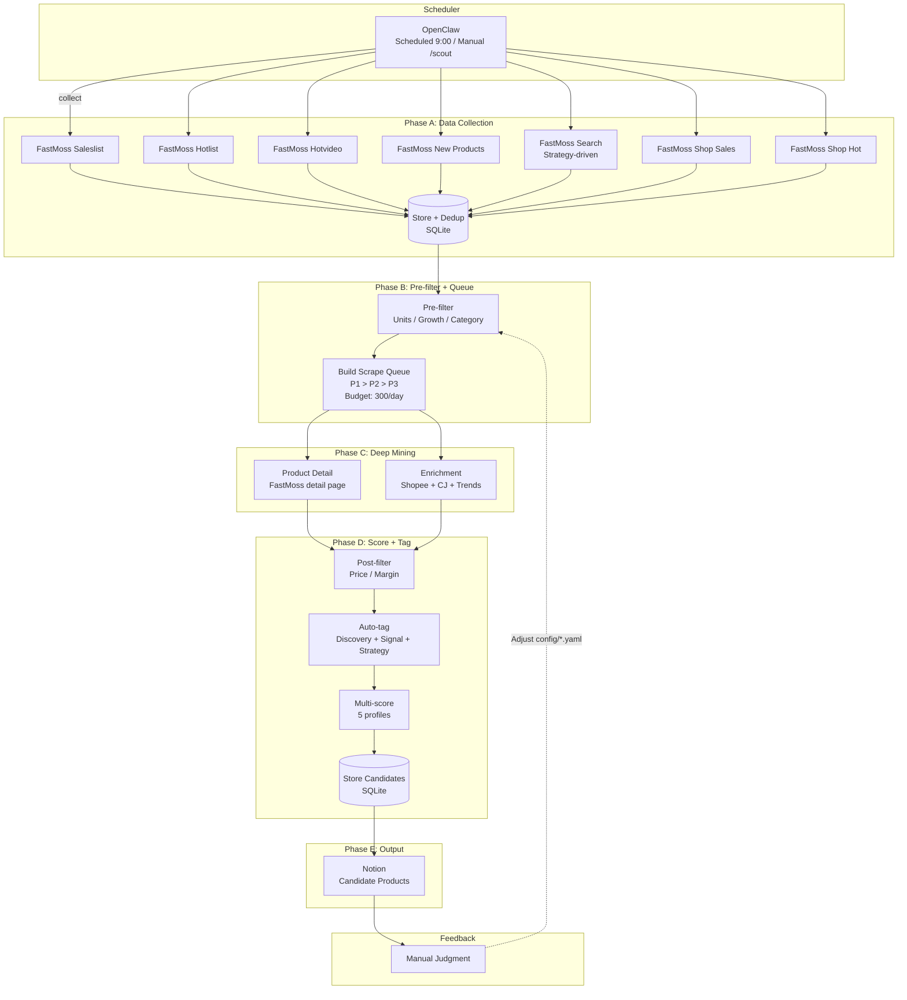

# Design

> Goal: Auto-collect Southeast Asia TikTok trending data → Rule filtering → Push candidate products to Notion
> **Target Market:** Southeast Asia (specific countries TBD)
> **Business Model:** TikTok content traffic → Independent site conversion

---

## 1. System Architecture

### Pipeline (5 Phases)



### Phase Summary

| Phase | What | Input | Output |
|-------|------|-------|--------|
| **A** | Collect from 7 FastMoss sources | Saleslist, Hotlist, Hotvideo, New Products, Search, Shop Sales, Shop Hot | products + product_snapshots |
| **B** | Pre-filter + build scrape queue | All products | Filtered queue (budget-limited) |
| **C** | Deep mine detail pages + enrich | Queue items | product_details + product_enrichments |
| **D** | Post-filter + tag + multi-score | All candidates | candidates + scores + tags |
| **E** | Sync to Notion | Unsynced candidates | Notion pages |

---

## 2. Data Sources

| Platform | Collection Method | Data Content | Purpose | Frequency |
|----------|-------------------|--------------|---------|-----------|
| **FastMoss — Saleslist** | Playwright + DOM extraction | Top-selling products, GMV, growth rate, commission | Discover trending products | Daily |
| **FastMoss — Hotlist** | Playwright + DOM extraction | Trending products, hot index, creator count, video views | Discover trending products | Daily |
| **FastMoss — Hotvideo** | Playwright + DOM extraction | Products with viral videos, view/like/comment counts | Discover viral content | Daily |
| **FastMoss — New Products** | Playwright + DOM extraction | Recently listed products (<3 days), early sales metrics | First-mover advantage | Daily |
| **FastMoss — Search** | Playwright + configurable filters | Strategy-driven product search (blue ocean, high margin) | Targeted discovery | Daily |
| **FastMoss — Shop Lists** | Playwright + DOM extraction | Top shop rankings (sales + hot), shop metrics | Find successful shops | Daily |
| **FastMoss — Shop Detail** | Playwright + DOM extraction | Shop detail page, per-product sales in shop | Deep dive into top shops | Daily (top 5) |
| **FastMoss — Product Detail** | Playwright + DOM extraction | Hot index, VOC, price, channel distribution, competition | Deep product analysis | On-demand (queue) |
| **Shopee** | Direct API fetch (`/api/v4/search/search_items`) | Price, sales, rating | Market demand validation | On-demand |
| **Google Trends SEA** | google-trends-api (90-day window) | Keyword search trends | Supplementary trend signal (5% weight) | On-demand |
| **CJ Dropshipping** | Official REST API (POST search) | Product cost, shipping ($3 default) | Cost/margin calculation | On-demand |

> For detailed technical decisions and rationale, see [architecture.md §3 — Design Principles](./architecture.md#3-design-principles).

---

## 3. Filtering Rules

### Basic Filters (configurable via config/rules.yaml)

Two-stage filtering with defaults + per-region overrides:

```yaml
# Pre-filter (Phase B — before deep mining, reduces unnecessary scraping)
minUnitsSold: 100          # Minimum units sold on TikTok
minGrowthRate: 0           # Minimum order growth rate
excludedCategories:        # Skip these categories
  - adult products
  - weapons
  - drugs

# Post-filter (Phase D — after enrichment data available)
price:
  min: 10                  # USD, Shopee validated price
  max: 30
profitMargin:
  min: 0.3                 # 30% minimum margin (shopeePrice - cjPrice - shipping) / shopeePrice
```

Per-region overrides supported (see [architecture.md §7](./architecture.md#7-configuration) for details).
Post-filter gracefully skips checks when enrichment data is missing (e.g., no Shopee match found).

### Multi-Strategy Scoring

5 scoring profiles, each with different dimension weights (configured in `config/scoring.yaml`):

| Profile | Purpose | Key Dimensions (top 3 by weight) |
|---------|---------|----------------------------------|
| **default** | Composite score | salesVolume 20%, salesGrowthRate 15%, shopeeValidation 15%, profitMargin 15% |
| **trending** | Explosive growth | salesGrowthRate 30%, hotIndex 25%, videoViews 20% |
| **blueOcean** | Low competition | competitionScore 35%, salesVolume 30%, creatorConversionRate 20% |
| **highMargin** | Profitability | profitMargin 40%, gpm 25%, commissionRate 20% |
| **shopCopy** | Shop expansion | productSalesInShop 30%, shopRating 25%, shopSalesGrowth 20% |

Each dimension is normalized to 0-100 using specific formulas:
- **Log scale**: salesVolume (relative), shopeeValidation, videoViews, productSalesInShop
- **Inverse**: creatorCount (fewer = better), competitionScore (fewer = better)
- **Linear**: growthRate, profitMargin, commissionRate, voc, shopRating
- **Sweet-spot**: pricePoint (peak at $20 USD)
- **Decay**: recency (linear decay over 120 days)
- **Categorical**: googleTrends (rising=100, stable=50, declining=0)

### Tag System

4 tag types, 3 generated automatically:

| Tag Type | Source | Examples |
|----------|--------|----------|
| **discovery** | Which FastMoss source found the product | `sales-rank`, `hotlist`, `hotvideo`, `newProducts`, `search` |
| **signal** | Rule-based from `config/signals.yaml` | `sales-surge`, `low-competition`, `high-commission`, `viral-video`, `new-product` |
| **strategy** | Scoring profiles that exceed threshold (default: 50) | `trending`, `blue-ocean`, `high-margin`, `shop-copy` |
| **manual** | User-applied in Notion | `track`, `skip`, custom labels |

Signal rules (8 rules in `config/signals.yaml`):

| Signal | Condition |
|--------|-----------|
| sales-surge | salesGrowthRate > 1.0 (100%+) |
| low-competition | creatorCount < 50 |
| high-commission | commissionRate > 0.15 (15%+) |
| high-gpm | gpm > 20 |
| viral-video | maxVideoViews > 1,000,000 |
| good-reviews | vocPositiveRate > 0.8 (80%+) |
| new-product | daysSinceListed < 30 |
| cross-border | shopType == "cross-border" |

### Scrape Queue

Priority-based queue for Phase C deep mining:

| Priority | Condition | Rationale |
|----------|-----------|-----------|
| **P1** (highest) | Product has no `product_details` record | Never scraped — get data first |
| **P2** | Details older than `detailRefreshDays` AND product reappeared today | Stale data for active product |
| **P3** | Manually tagged with `track` | User explicitly wants tracking |

Budget: `dailyDetailBudget` (default 300) limits total items processed per day.
Failed items retry up to 3 times before being marked permanently failed.

---

## 4. CLI Commands

| Command | Function |
|---------|----------|
| `bun run scripts/scout.ts --region th` | Run product selection flow (launches Chrome automatically) |
| `bun run scripts/scout.ts --region th --limit 5 --dry-run` | Dry run (no Notion sync) |
| `bun run scripts/scout.ts --region th --skip-scrape` | Skip Phase A (re-process existing data) |
| `bun run scripts/status.ts` | Check database status |
| `bun run scripts/top.ts --limit 10` | View Top 10 candidates |

### CLI Arguments (scout.ts)

| Flag | Type | Default | Description |
|------|------|---------|-------------|
| `--region` | string | `th` | Target region (th, id, ph, vn, my) |
| `--category` | string | - | Filter by category |
| `--limit` | string | - | Max products to scrape per source |
| `--dry-run` | boolean | false | Skip Notion sync (Phase E) |
| `--skip-scrape` | boolean | false | Skip data collection (Phase A) |

---

## 5. Development Plan

- **Phase 1: Project Initialization** ✅ — Git repo, Bun project, ESLint/Prettier, pre-commit hooks
- **Phase 2: Data Collection + Filtering + Output** ✅ — SQLite, FastMoss scraper, Shopee API, Google Trends, CJ API, two-stage filter, 5-dimension scorer, Notion sync
- **Phase 3: Deep Mining + Multi-Strategy** ✅ — 11-table schema, 10 FastMoss scrapers, multi-strategy scoring (5 profiles), tag system (discovery/signal/strategy), scrape queue with priority and budget, enrichment converters, 5-phase pipeline (A→E)
- **Phase 4: Scheduling & Automation** — TODO:
  - [ ] Scheduled daily execution (cron or similar)
  - [ ] Add monitoring and alerting
  - [ ] Support multi-region parallel runs

---

## 6. Known Issues & Risks

> For error handling and graceful degradation details, see [architecture.md §3 — Design Principles](./architecture.md#3-design-principles).

| # | Category | Issue | Impact | Status |
|---|----------|-------|--------|--------|
| 1 | Data Matching | CJ product matching is inaccurate — uses raw product name (possibly Thai/Vietnamese) to search CJ (English), takes first result without similarity check | Profit margin may be unreliable | Open |
| 2 | Data Matching | Shopee matching has the same problem — keyword search takes first result without verifying it's the same product | Price/sales validation may reference wrong product | Open |
| 3 | Data Matching | Google Trends keyword mismatch — non-English product names may return no data, falls back to "stable" (50 pts) | Trend signal unreliable for non-English; 5% weight limits impact | Open |
| 4 | Data Quality | Shipping cost is a fixed $3 estimate — actual cost varies by country, weight, and logistics channel | Profit margin calculation is approximate | Open |
| 5 | Data Quality | Shopee API returns 403 intermittently — consider switching to Playwright for better anti-detection | Products may pass filtering without Shopee validation | Open |
| 6 | Functionality | Notion duplicate sync — each pipeline run creates new pages, no dedup or update mechanism | Duplicate entries accumulate in Notion | Open |
| 7 | Functionality | No scheduled execution — Phase 4 not yet implemented, CLI-only | Requires manual trigger daily | Open |
| 8 | Functionality | No multi-region parallel runs — regions must be run sequentially | Slower for multi-country scouting | Open |

### MVP Success Criteria

- [x] Manual CLI trigger (`bun run scripts/scout.ts`)
- [x] Candidate products visible in Notion with TikTok data + Shopee validation + cost + score
- [x] Manual judgment fields in Notion (Image, Status, Notes)
- [x] Multi-strategy scoring (5 profiles) with per-dimension breakdown
- [x] Auto-tagging (discovery, signal, strategy)
- [x] Deep mining with product details and enrichment
- [ ] Scheduled daily execution
- [ ] Multi-region parallel runs
