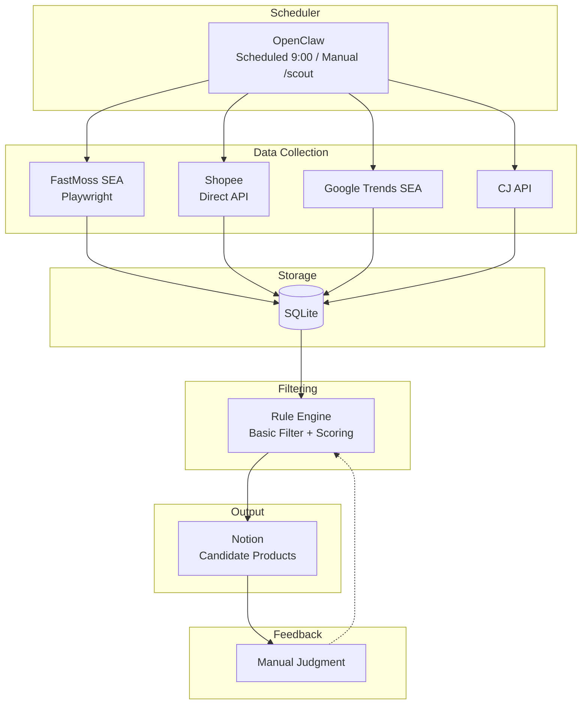

# Design

> Goal: Auto-collect Southeast Asia TikTok trending data → Rule filtering → Push candidate products to Notion
> **Target Market:** Southeast Asia (specific countries TBD)
> **Business Model:** TikTok content traffic → Independent site conversion

---

## 1. System Architecture

### Overall Architecture (MVP)



### Data Flow

```
FastMoss SEA → Shopee Validation → Google Trends → CJ Cost → Rule Filtering → Notion
     ↓              ↓                  ↓            ↓            ↓
  Discover      Validate           Supplement    Calculate    Output
   Trends        Demand             Signal        Profit     Candidates
```

---

## 2. Data Sources

| Platform | Collection Method | Data Content | Purpose | Frequency |
|----------|-------------------|--------------|---------|-----------|
| **TikTok SEA** | FastMoss (Playwright persistent context + system Chrome + DOM extraction) | Top-selling products, GMV, growth rate, commission | Discover trending products | Daily |
| **Shopee** | Direct API fetch (`/api/v4/search/search_items`) | Search results, price, sales, rating | Validate market demand | Daily |
| **Google Trends SEA** | google-trends-api (90-day window) | Keyword search trends | Supplementary trend signal (10% weight) | On-demand |
| **CJ Dropshipping** | Official REST API (POST search) | Product cost, shipping ($3 default), inventory | Cost calculation | On-demand |

> For detailed technical decisions and rationale, see [architecture.md §7 — Key Technical Decisions](./architecture.md#7-key-technical-decisions).

---

## 3. Filtering Rules

### Basic Filters (configurable via config/rules.yaml)

Two-stage filtering with defaults + per-region overrides:

```yaml
# Pre-filter (before external API calls — reduces unnecessary requests)
minUnitsSold: 100          # Minimum units sold on TikTok
minGrowthRate: 0           # Minimum order growth rate
excludedCategories:        # Skip these categories
  - adult products
  - weapons
  - drugs

# Post-filter (after Shopee/CJ enrichment)
price:
  min: 10                  # USD, Shopee validated price
  max: 30
profitMargin:
  min: 0.3                 # 30% minimum margin (shopeePrice - cjPrice - shipping) / shopeePrice
```

Per-region overrides supported (see [architecture.md §8](./architecture.md#8-configuration-system) for details).
Post-filter gracefully skips checks when enrichment data is missing (e.g., no Shopee match found).

### Composite Scoring

| Dimension | Weight | Calculation | Notes |
|-----------|--------|-------------|-------|
| Sales Volume | 30% | unitsSold / maxUnits * 100 | Relative to current batch max |
| Order Growth | 20% | growthRate * 100 (capped at 100) | Direct percentage mapping |
| Shopee Validation | 25% | log10(soldCount) / log10(1000) * 100 | **Log scale**: 10 sales ~ 33, 100 ~ 67, 1000+ = 100 |
| Profit Margin | 15% | profitMargin * 100 | Based on (shopeePrice - cjPrice - shipping) / shopeePrice |
| Google Trends | 10% | rising=100, stable=50, declining=0 | Falls back to "stable" (50 pts) on any error |

**Final score**: Weighted sum of all dimensions, rounded to 1 decimal place (0-100 range).

---

## 4. CLI Commands

| Command | Function |
|---------|----------|
| `bun run scripts/scout.ts --region th` | Run product selection flow (launches Chrome automatically) |
| `bun run scripts/scout.ts --region th --limit 5 --dry-run` | Dry run (no Notion sync) |
| `bun run scripts/status.ts` | Check database status |
| `bun run scripts/top.ts --limit 10` | View Top 10 candidates |

### CLI Arguments (scout.ts)

| Flag | Type | Default | Description |
|------|------|---------|-------------|
| `--region` | string | `th` | Target region (th, id, ph, vn, my) |
| `--category` | string | - | Filter by category |
| `--limit` | string | - | Max products to scrape |
| `--dry-run` | boolean | false | Skip Notion sync |

---

## 5. Development Plan

### Phase 1: Project Initialization ✅
- [x] Create Git repository
- [x] Initialize Bun project
- [x] Create project directory structure
- [x] Configure tsconfig.json and .gitignore
- [x] Configure ESLint and Prettier
- [x] Set up pre-commit hooks

### Phase 2: Data Collection ✅
- [x] Set up SQLite database structure
- [x] Implement FastMoss scraper (replaced Apify TikTok — Apify lacked SEA coverage)
- [x] Develop Shopee product search (direct API fetch, not Playwright — more reliable)
- [x] Integrate google-trends-api (SEA)
- [x] Integrate CJ Dropshipping API

### Phase 3: Filtering and Output ✅
- [x] Implement rule filtering engine (two-stage: pre-filter + post-filter)
- [x] Implement scoring calculation (5-dimension weighted composite)
- [x] Develop Notion sync module

### Phase 4: Scheduling & Automation
- [ ] Implement scheduled execution (cron or similar)
- [ ] Add monitoring and alerting
- [ ] Support multi-region parallel runs

---

## 6. Research Findings

### Resolved Items

| Item | Resolution |
|------|------------|
| Specific SEA country selection | TH and ID enabled; PH, VN, MY available but disabled. See [architecture.md §8](./architecture.md#8-configuration-system) for details. |
| Apify TikTok SEA support | **Abandoned** — replaced with FastMoss. |
| Shopee anti-scraping strategy | Using direct API fetch with graceful degradation. |
| SEA price range research | Default $10-30 USD with per-region overrides. |
| CJ SEA shipping time/cost | Using $3 USD flat estimate. |

### Risks and Mitigation

> For error handling and graceful degradation details, see [architecture.md §3 — Design Principles](./architecture.md#3-design-principles).

| Risk | Level | Mitigation | Status |
|------|-------|------------|--------|
| Shopee anti-scraping | Medium | Direct API + graceful degradation | Mitigated |
| FastMoss WAF blocking | High | System Chrome + non-headless mode | Mitigated |
| FastMoss session expiry | Medium | Persistent profile + redirect detection | Mitigated |
| Google Trends rate limiting | Low | Fallback to "stable", only 10% weight | Mitigated |
| Notion API rate limiting | Low | Sequential creation, continues on failure | Mitigated |
| Inaccurate filtering rules | Expected | Per-region overrides, iterate through practice | Ongoing |

### Known Issues

| # | Category | Issue | Impact | Possible Improvement |
|---|----------|-------|--------|---------------------|
| 1 | Data Matching | CJ product matching is inaccurate — uses raw product name (possibly Thai/Vietnamese) to search CJ (English), takes first result without similarity check | Profit margin calculation may be unreliable | Translate product name to English before CJ search; add similarity scoring to filter irrelevant results |
| 2 | Data Matching | Shopee matching has the same problem — keyword search takes first result without verifying it's the same product | Shopee price/sales validation may reference wrong product | Add title similarity check; use multiple results and pick best match |
| 3 | Data Matching | Google Trends keyword mismatch — non-English product names may return no data, falls back to "stable" (50 pts) | Trend signal is unreliable for non-English products; 10% weight limits impact | Extract English keywords or translate before querying |
| 4 | Runtime | FastMoss requires manual login — first run and session expiry require manually logging in via the Chrome window | Cannot fully automate; blocks unattended scheduled runs | Investigate cookie injection or headless login flow |
| 5 | Runtime | Non-headless mode required — FastMoss WAF blocks headless Chrome, must use `headless: false` | Cannot run on headless servers (CI/CD, cloud VMs) | Investigate stealth plugins or alternative data sources |
| 6 | Data Quality | Shipping cost is a fixed $3 estimate — actual cost varies by country, weight, and logistics channel | Profit margin calculation is approximate | Query CJ shipping API with specific SKU + destination when available |
| 7 | Data Quality | Shopee API returns 403 intermittently — graceful degradation returns `[]`, but loses price validation data | Products may pass filtering without Shopee validation | Add retry with backoff; rotate User-Agent; consider Shopee affiliate API |
| 8 | Functionality | Notion duplicate sync — each pipeline run creates new pages, no dedup or update mechanism | Duplicate entries accumulate in Notion database | Check existing pages by product name before creating; update if exists |
| 9 | Functionality | No scheduled execution — Phase 4 not yet implemented, CLI-only | Requires manual trigger daily | Implement cron-based scheduling |
| 10 | Functionality | No multi-region parallel runs — regions must be run sequentially | Slower for multi-country scouting | Support concurrent region pipelines |

### Cost Estimate

| Item | Cost | Notes |
|------|------|-------|
| FastMoss | Free tier | Web scraping with persistent login |
| CJ API | Free | Official REST API |
| Google Trends | Free | google-trends-api package |
| Notion | Free | API within workspace limits |
| **Total** | **$0/month** | All services used within free tiers |

---

## 7. MVP Success Criteria

- [x] Can trigger collection flow manually via CLI (`bun run scripts/scout.ts`)
- [x] Can see candidate product list in Notion
- [x] Each candidate has: TikTok data + Shopee validation + cost + score
- [x] Can record subjective judgment in Notion (manual fields: Image, Status, Notes)
- [ ] Scheduled daily execution
- [ ] Multi-region parallel runs
