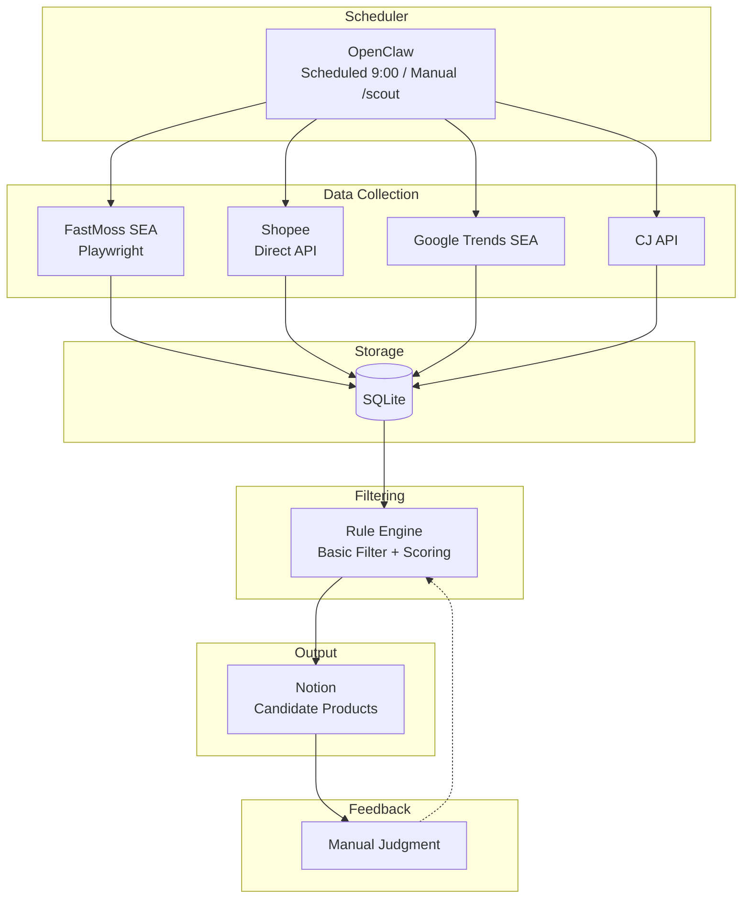

# Design

> Goal: Auto-collect Southeast Asia TikTok trending data → Rule filtering → Push candidate products to Notion
> **Target Market:** Southeast Asia (specific countries TBD)
> **Business Model:** TikTok content traffic → Independent site conversion

---

## 1. System Architecture

### Overall Architecture (MVP)



### Data Flow

```
FastMoss SEA → Shopee Validation → Google Trends → CJ Cost → Rule Filtering → Notion
     ↓              ↓                  ↓            ↓            ↓
  Discover      Validate           Supplement    Calculate    Output
   Trends        Demand             Signal        Profit     Candidates
```

---

## 2. Data Sources

| Platform | Collection Method | Data Content | Purpose | Frequency |
|----------|-------------------|--------------|---------|-----------|
| **TikTok SEA** | FastMoss (Playwright) | Top-selling products, GMV, growth rate, commission | Discover trending products | Daily |
| **Shopee** | Direct API fetch | Search results, price, sales, rating | Validate market demand | Daily |
| **Google Trends SEA** | google-trends-api | Keyword search trends | Supplementary trend signal | On-demand |
| **CJ Dropshipping** | Official API | Product cost, shipping, inventory | Cost calculation | On-demand |

---

## 3. Filtering Rules

### Basic Filters (configurable)

```yaml
# config/rules.yaml
price_min: 10
price_max: 30
weight_max: 500
profit_margin_min: 0.3
shopee_sales_min: 100
trend_status: rising
excluded_categories:
  - electronics
  - food
  - cosmetics
```

### Composite Scoring

| Dimension | Weight | Calculation |
|-----------|--------|-------------|
| Sales Volume | 30% | unitsSold / maxUnits * 100 |
| Order Growth | 20% | growthRate * 100 (capped at 100) |
| Shopee Validation | 25% | log10(soldCount) / log10(1000) * 100 |
| Profit Margin | 15% | profitMargin * 100 |
| Google Trends | 10% | rising=100, stable=50, declining=0 |

---

## 4. OpenClaw Integration

### Interactive Commands

| Command | Function |
|---------|----------|
| `/scout` | Run product selection flow immediately |
| `/scout status` | Check today's collection status |
| `/scout top 10` | View today's Top 10 candidates |

---

## 5. Development Plan

### Phase 1: Project Initialization ✅
- [x] Create Git repository
- [x] Initialize Bun project
- [x] Create project directory structure
- [x] Configure tsconfig.json and .gitignore
- [x] Configure ESLint and Prettier
- [x] Set up pre-commit hooks

### Phase 2: Data Collection ✅
- [x] Set up SQLite database structure
- [x] Implement FastMoss scraper (replaced Apify TikTok — Apify lacked SEA coverage)
- [x] Develop Shopee product search (direct API fetch, not Playwright — more reliable)
- [x] Integrate google-trends-api (SEA)
- [x] Integrate CJ Dropshipping API

### Phase 3: Filtering and Output ✅
- [x] Implement rule filtering engine (two-stage: pre-filter + post-filter)
- [x] Implement scoring calculation (5-dimension weighted composite)
- [x] Develop Notion sync module

### Phase 4: OpenClaw Integration
- [ ] Create SKILL.md entry file
- [ ] Develop interactive command scripts
- [ ] Test scheduled tasks

---

## 6. Project Planning

### Research Items

| Item | Impact | Priority |
|------|--------|----------|
| Specific SEA country selection | Determines data collection region parameters | High |
| Apify TikTok SEA support | May need alternative solution | High |
| Shopee anti-scraping strategy | Affects data collection stability | Medium |
| SEA price range research | Filter rule parameters | Medium |
| CJ SEA shipping time/cost | Affects profit calculation | Medium |

### Risks and Mitigation

| Risk | Level | Mitigation |
|------|-------|------------|
| Shopee anti-scraping | High | Rate limiting, only scrape public lists, proxy IP, graceful degradation |
| TikTok SEA data unavailable | Medium | Manual observation or find other data sources |
| Notion API rate limiting | Low | Batch writes, control frequency |
| Inaccurate filtering rules | Expected | Iterate through practice |

### Cost Estimate

| Item | Cost | Notes |
|------|------|-------|
| Apify | ~$50/month | TikTok data collection |
| Proxy IP | ~$20/month | For Shopee scraper (optional) |
| OpenClaw | Free | Open source, runs locally |
| **Total** | **~$50-70/month** | |

---

## 7. MVP Success Criteria

- [ ] Can trigger collection flow on schedule or manually
- [ ] Can see candidate product list in Notion
- [ ] Each candidate has: TikTok data + Shopee validation + cost + score
- [ ] Can record subjective judgment in Notion
