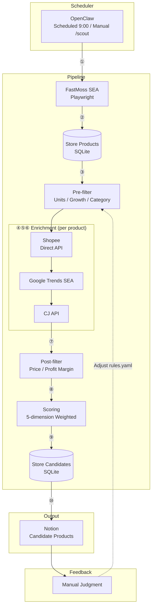

# Design

> Goal: Auto-collect Southeast Asia TikTok trending data → Rule filtering → Push candidate products to Notion
> **Target Market:** Southeast Asia (specific countries TBD)
> **Business Model:** TikTok content traffic → Independent site conversion

---

## 1. System Architecture

### Architecture (MVP)



---

## 2. Data Sources

| Platform | Collection Method | Data Content | Purpose | Frequency |
|----------|-------------------|--------------|---------|-----------|
| **TikTok SEA** | FastMoss (Playwright persistent context + system Chrome + DOM extraction) | Top-selling products, GMV, growth rate, commission | Discover trending products | Daily |
| **Shopee** | Direct API fetch (`/api/v4/search/search_items`) | Search results, price, sales, rating | Validate market demand | Daily |
| **Google Trends SEA** | google-trends-api (90-day window) | Keyword search trends | Supplementary trend signal (10% weight) | On-demand |
| **CJ Dropshipping** | Official REST API (POST search) | Product cost, shipping ($3 default), inventory | Cost calculation | On-demand |

> For detailed technical decisions and rationale, see [architecture.md §3 — Design Principles](./architecture.md#3-design-principles).

---

## 3. Filtering Rules

### Basic Filters (configurable via config/rules.yaml)

Two-stage filtering with defaults + per-region overrides:

```yaml
# Pre-filter (before external API calls — reduces unnecessary requests)
minUnitsSold: 100          # Minimum units sold on TikTok
minGrowthRate: 0           # Minimum order growth rate
excludedCategories:        # Skip these categories
  - adult products
  - weapons
  - drugs

# Post-filter (after Shopee/CJ enrichment)
price:
  min: 10                  # USD, Shopee validated price
  max: 30
profitMargin:
  min: 0.3                 # 30% minimum margin (shopeePrice - cjPrice - shipping) / shopeePrice
```

Per-region overrides supported (see [architecture.md §7](./architecture.md#7-configuration) for details).
Post-filter gracefully skips checks when enrichment data is missing (e.g., no Shopee match found).

### Composite Scoring

| Dimension | Weight | Calculation | Notes |
|-----------|--------|-------------|-------|
| Sales Volume | 30% | unitsSold / maxUnits * 100 | Relative to current batch max |
| Order Growth | 20% | growthRate * 100 (capped at 100) | Direct percentage mapping |
| Shopee Validation | 25% | log10(soldCount) / log10(1000) * 100 | **Log scale**: 10 sales ~ 33, 100 ~ 67, 1000+ = 100 |
| Profit Margin | 15% | profitMargin * 100 | Based on (shopeePrice - cjPrice - shipping) / shopeePrice |
| Google Trends | 10% | rising=100, stable=50, declining=0 | Falls back to "stable" (50 pts) on any error |

**Final score**: Weighted sum of all dimensions, rounded to 1 decimal place (0-100 range).

---

## 4. CLI Commands

| Command | Function |
|---------|----------|
| `bun run scripts/scout.ts --region th` | Run product selection flow (launches Chrome automatically) |
| `bun run scripts/scout.ts --region th --limit 5 --dry-run` | Dry run (no Notion sync) |
| `bun run scripts/status.ts` | Check database status |
| `bun run scripts/top.ts --limit 10` | View Top 10 candidates |

### CLI Arguments (scout.ts)

| Flag | Type | Default | Description |
|------|------|---------|-------------|
| `--region` | string | `th` | Target region (th, id, ph, vn, my) |
| `--category` | string | - | Filter by category |
| `--limit` | string | - | Max products to scrape |
| `--dry-run` | boolean | false | Skip Notion sync |

---

## 5. Development Plan

- **Phase 1: Project Initialization** ✅ — Git repo, Bun project, ESLint/Prettier, pre-commit hooks
- **Phase 2: Data Collection + Filtering + Output** ✅ — SQLite, FastMoss scraper, Shopee API, Google Trends, CJ API, two-stage filter, 5-dimension scorer, Notion sync
- **Phase 3: Scheduling & Automation** — TODO:
  - [ ] Scheduled daily execution (cron or similar)
  - [ ] Add monitoring and alerting
  - [ ] Support multi-region parallel runs

---

## 6. Known Issues & Risks

> For error handling and graceful degradation details, see [architecture.md §3 — Design Principles](./architecture.md#3-design-principles).

| # | Category | Issue | Impact | Status |
|---|----------|-------|--------|--------|
| 1 | Data Matching | CJ product matching is inaccurate — uses raw product name (possibly Thai/Vietnamese) to search CJ (English), takes first result without similarity check | Profit margin may be unreliable | Open |
| 2 | Data Matching | Shopee matching has the same problem — keyword search takes first result without verifying it's the same product | Price/sales validation may reference wrong product | Open |
| 3 | Data Matching | Google Trends keyword mismatch — non-English product names may return no data, falls back to "stable" (50 pts) | Trend signal unreliable for non-English; 10% weight limits impact | Open |
| 4 | Runtime | FastMoss requires manual login — first run and session expiry require manually logging in via Chrome | Cannot fully automate; blocks unattended scheduled runs | Open |
| 5 | Runtime | Non-headless mode required — FastMoss WAF blocks headless Chrome | Cannot run on headless servers (CI/CD, cloud VMs) | Open |
| 6 | Data Quality | Shipping cost is a fixed $3 estimate — actual cost varies by country, weight, and logistics channel | Profit margin calculation is approximate | Open |
| 7 | Data Quality | Shopee API returns 403 intermittently — graceful degradation returns `[]`, but loses validation data | Products may pass filtering without Shopee validation | Mitigated |
| 8 | Functionality | Notion duplicate sync — each pipeline run creates new pages, no dedup or update mechanism | Duplicate entries accumulate in Notion | Open |
| 9 | Functionality | No scheduled execution — Phase 4 not yet implemented, CLI-only | Requires manual trigger daily | Open |
| 10 | Functionality | No multi-region parallel runs — regions must be run sequentially | Slower for multi-country scouting | Open |

### MVP Success Criteria

- [x] Manual CLI trigger (`bun run scripts/scout.ts`)
- [x] Candidate products visible in Notion with TikTok data + Shopee validation + cost + score
- [x] Manual judgment fields in Notion (Image, Status, Notes)
- [ ] Scheduled daily execution
- [ ] Multi-region parallel runs
